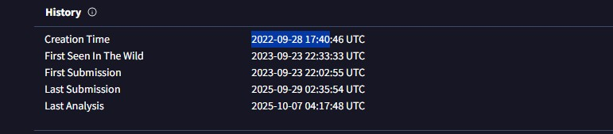
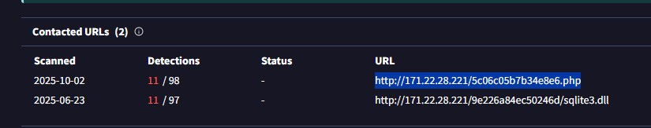
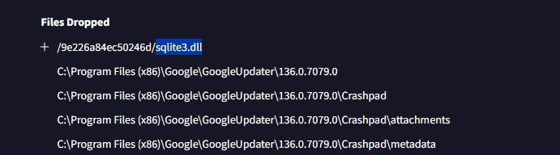
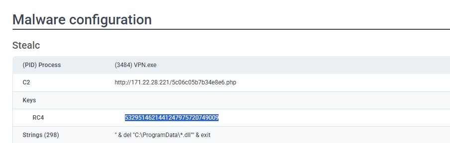
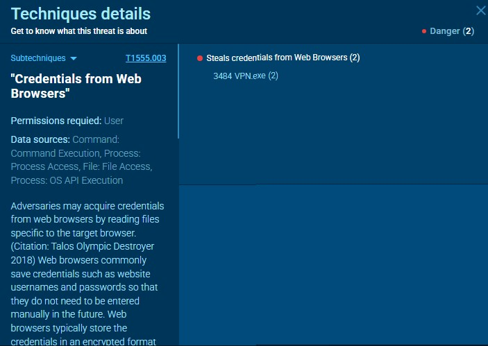
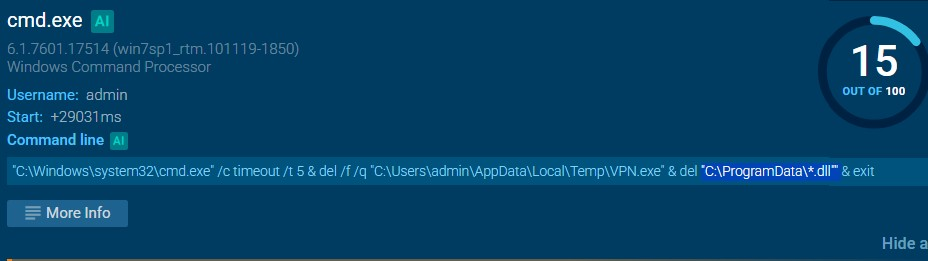
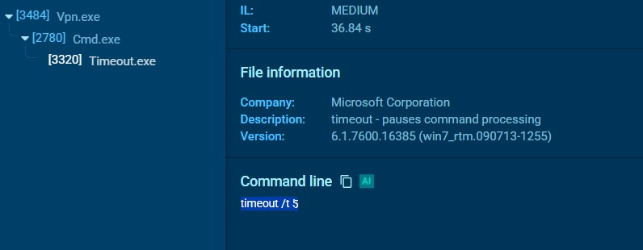

# Oski Lab – CyberDefenders

### Scenario
The accountant at the company received an email titled "Urgent New Order" from a client late in the afternoon. When he attempted to access the attached invoice, he discovered it contained false order information. Subsequently, the SIEM solution generated an alert regarding downloading a potentially malicious file. Upon initial investigation, it was found that the PPT file might be responsible for this download. Could you please conduct a detailed examination of this file?

---

## Questions:

Q1 : What was the time of malware creation?  
Answer : `2022-09-28 17:40`  

___

Q2 : Which C2 server does the malware in the PPT file communicate with?  
Answer : `http://171.22.28.221/5c06c05b7b34e8e6.php`  

___

Q3 : What is the first library that the malware requests post-infection?  
Answer : `sqlite3.dll`  

___

Q4 : What RC4 key is used by the malware to decrypt its base64-encoded string?  
Answer : `5329514621441247975720749009`  

___

Q5 : Identify the main MITRE ATT&CK technique the malware uses to steal the user’s password.  
Answer : `T1555`  

___

Q6 : Which directory does the malware target for the deletion of all DLL files?  
Answer : `C:\ProgramData`  

___

Q7 : After successfully exfiltrating the user's data, how many seconds does it take for the malware to self-delete?  
Answer : `5`  

___

---

## What I Learned:

- Gained hands-on experience analyzing **malicious PPT files** in a sandbox environment.  
- Learned how to trace **C2 server communications** and identify initial malware actions.  
- Understood the use of **RC4 encryption** and how malware encodes sensitive data.  
- Applied **MITRE ATT&CK** techniques to classify malware behavior and map attack patterns.  
- Improved my skills in **child process monitoring**, **file targeting**, and **malware self-deletion analysis**.  

This lab enhanced my ability to perform **malware analysis**, **incident investigation**, and **Blue Team threat detection** in real-world scenarios.

---

### References :
- [CyberDefenders – Oski Challenge](https://cyberdefenders.org/blueteam-ctf-challenges/challenge/oski/)
